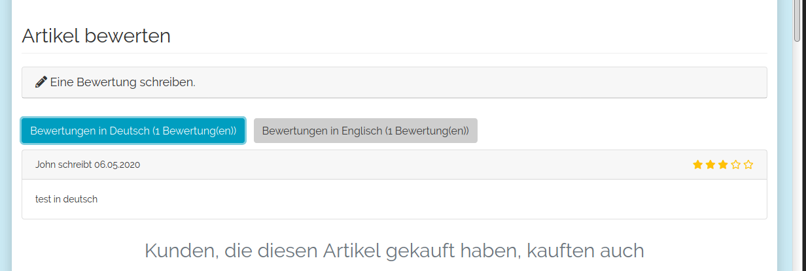

# Oxid Reviews

## Description

Give the user the option to display reviews in different languages.

## Install

1. Copy files into following directory

        source/modules/rs/reviews
        
2. Add following to composer.json on the shop root

        "autoload": {
            "psr-4": {
                "rs\\reviews\\": "./source/modules/rs/reviews"
            }
        },
    
3. Refresh autoloader files with composer.

        composer dump-autoload

4. Template changes

    Make following changes on file /source/Application/views/wave_cust/tpl/page/details/inc/fullproductinfo.tpl

        

            
[{oxmultilang ident="WRITE_PRODUCT_REVIEW"}]

            [{* rs-reviews start *}]
            [{block name="rs_reviews"}]
            [{* rs-reviews end *}]
            [{include file="widget/reviews/reviews.tpl"}]
            [{* rs-reviews start *}]
            [{/block}]
            [{* rs-reviews end *}]
        

        
5. Enable module in the oxid admin area, Extensions => Modules

6. Clear template and language cache

